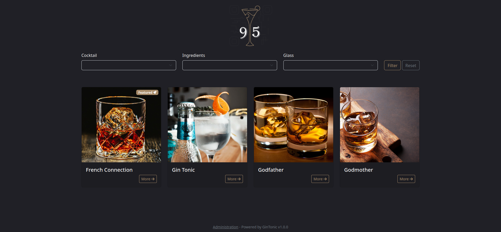

# Gintonic

Gintonic is a bar manager aimed at associative bars and home baristas : add the cocktails you love to make and let your clients/friends browse through the available recipes !

100% free and open-source, feel free to self-host and send your feedback !




## Features

- Create cocktails recipes
- Configure ingredients
- Show cocktails based on ingredients availability
- Add ingredients to shopping list
- Customization options (your logo, your name)
- Receive orders (no payment yet !)


## Todo list
- [ ]  Allow to disable features when not needed (ingredients availability) 
- [ ]  Add a basket to order multiple cocktails at once
- [ ]  Provide default cocktails, ingredients, units & glasses when installing

## Installation

Gintonic is a fairly standard Symfony 7 application which requires :

- A webserver of your choice
- PHP 8.3, Composer, Npm or Yarn
- A MariaDB (or MySQL) server
- An SMTP server (if you want to get mail notifications)

First clone the projet, then copy the .env file to .env.local and edit the newly created file with the configuration needed.
The options are documented in the file.

Be sure to change the APP_SECRET option !

Then execute these commands :

```
composer install 
bin/console doctrine:schema:update --force 
yarn install
yarn encore prod
```
If your web & database servers are configured correctly and everything went right, you should now be able to access your new Gintonic instance !

## Contributing

Contributions are welcome through merge-requests, but please discuss your idea in a ticket first !

## Authors

- [@SimonVanacco](https://github.com/SimonVanacco)

