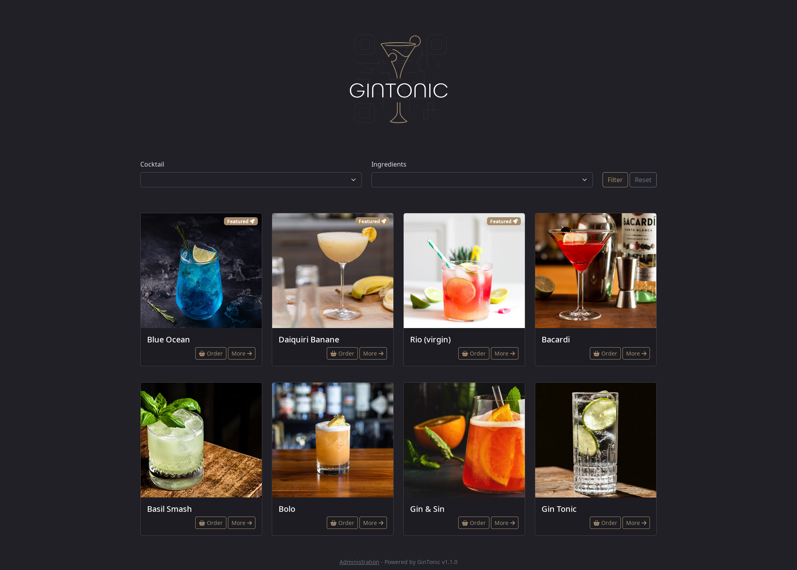
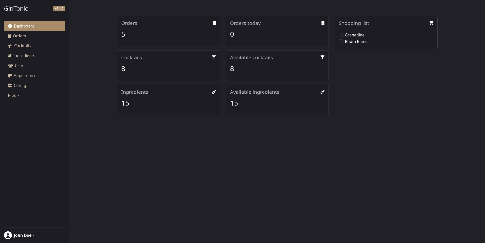

# Gintonic

Gintonic is a self-hosted homebar manager : add the cocktails you love to make and let your friends browse through the available recipes !




## Features

- Create cocktails recipes
- Configure ingredients
- Show cocktails based on ingredients availability
- Add ingredients to shopping list
- Receive orders (still WIP)


## Todo list
- [ ]  Allow customization options (custom CSS, logo, footer)
- [ ]  Add a basket to order multiple cocktails at once
- [ ]  Provide default cocktails, ingredients, units & glasses when installing

## Installation

Gintonic is a fairly standard Symfony 6 application which requires :

- A webserver of your choice
- PHP 8.2+, Composer, Npm / Yarn
- A MySQL server
- A SMTP server (if you want to get mail notifications)

First clone the projet, then copy the .env file to .env.local and edit the newly created file with the configuration needed.
The options are documented in the file.

Be sure to change the APP_SECRET option !

Then execute these commands :

```
composer install 
bin/console doctrine:schema:update --force 
yarn install
yarn encore prod
```
If your web & database servers are configured correctly and everything went right, you should now be able to access your new Gintonic instance !

## Contributing

Contributions are welcome through merge-requests, but please discuss your idea in a ticket first !

## Authors

- [@SimonVanacco](https://github.com/SimonVanacco)

